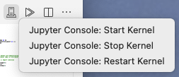
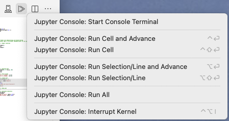
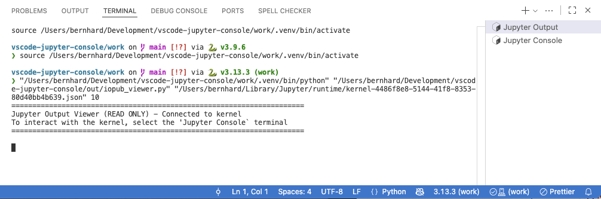
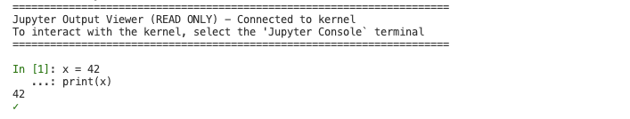
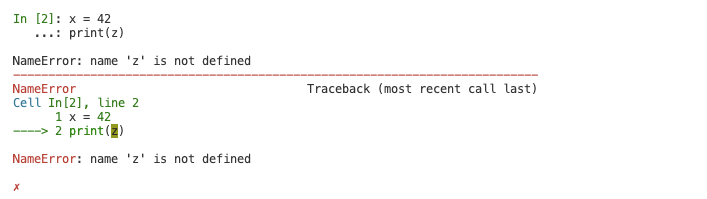
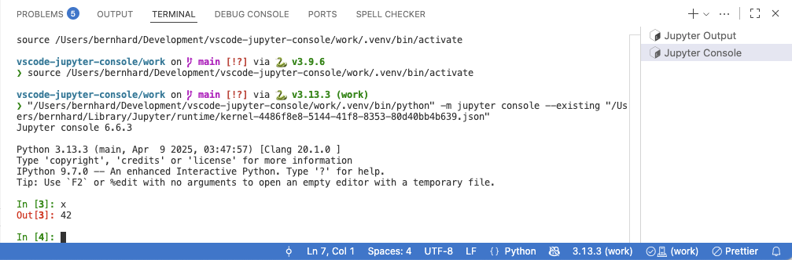
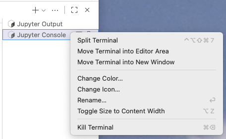

# Jupyter Console for VS Code

A VS Code extension that integrates Jupyter kernels with console interface for interactive Python development. Execute Python code directly from your editor and see results in dedicated output terminals.

## Installation

### Prerequisites

1. **Python 3.x** installed on your system
2. **VS Code Python Extension** (`ms-python.python`)
3. **jupyter-console** installed in your Python environment:
   ```bash
   pip install jupyter jupyter-console
   ```

### Install the Extension

#### From VSIX File

1. Download the `.vsix` file from the github "Release" section for your operating system.
2. In VS Code, open the Command Palette (`Cmd+Shift+P` / `Ctrl+Shift+P`)
3. Run `Extensions: Install from VSIX...`
4. Select the downloaded `.vsix` file

#### From VS Code Marketplace

_(Coming soon)_

### Initial Setup

1. Open a Python file in VS Code
2. Select a Python interpreter: `Python: Select Interpreter` from Command Palette
3. The extension will automatically detect your Python environment

## User Guide

### Status Bar

The extension adds a status bar item on the right side showing the kernel state

**Status Bar States:**

| State        | Icon         | Status Bar                                                          | Meaning            | Click Action  |
| ------------ | ------------ | ------------------------------------------------------------------- | ------------------ | ------------- |
| **Stopped**  | ⊘            |  | No kernel running  | Starts kernel |
| **Starting** | ⟳ (animated) |        | Kernel starting up | No action     |
| **Running**  | ✓            |  | Kernel ready       | No action     |
| **Busy**     | ⟳ (animated) |        | Executing code     | No action     |

**Environment Display:**
The status bar shows your Python environment name (e.g., `venv`, `conda_env`, or `Python`), automatically extracted from your selected Python interpreter. In the above table the python environment is `work`.

### Editor Actions Menu

When editing Python files, a _Jupyter Kernel_ and a _Run in Console_ menu appears in the editor toolbar:

- _Jupyter Kernel_ menu

  The _Jupyter Kernel_ menu provides quick access to: `Start Kernel`, `Stop Kernel`, `Restart Kernel`, `Interrupt Kernel`, and `Start Console Terminals`

  

- "_Run in Console_ menu

  The _Run in Console_ menu provides quick access to: `Run Cell and Advance`, `Run Cell`, `Run Selection and Advance`, and `Run Selection`

  

### Output Terminals

The extension creates two dedicated terminals. One as a read-only output window, which shows all input code and outputs of running statements against the started kernel. In case one wants to interactively examine variables or test some code, the second terminal is a standard Jupyter Console, connected to the same kernel. You can see and modify any variables, reset the state without removing imports (huge time saver!), or test some new code.

1. **Jupyter Output Terminal (read only)**

   Displays formatted execution results with input code (green In[n] labels), standard output, and colored error messages. Input code is truncated after 10 lines by default (configurable).

   

   The **Jupyter Output** terminal shows:

   - **Input code** with green `In [n]` labels
   - **Standard output** from your code
   - **Execution results** with red `Out[n]` labels
   - **Errors** with full tracebacks
   - **Success indicators** (green ✓) or **error indicators** (red ✗)

   This terminal connects directly to the kernel's IOPub channel using a Python script (`iopub_viewer.py`) that subscribes to all kernel messages using the Jupyter protocol. This means for example that print statements will be immediately shown.

   - Successful code execution

     

   - Failed code execution

     

2. **Jupyter Console Terminal (standard interactive jupyter-console)**

   Traditional jupyter-console interface for interactive debugging and exploration. This console is connected to the same Jupyter kernel and can see and change all variables. Interactive statements will be shown in the "Jupyter Output" window.

   

   The **Jupyter Console** terminal provides:

   - Interactive Python REPL connected to the same kernel
   - Full IPython features (magic commands, shell access, tab completion)
   - Useful for debugging and interactive exploration

   **To start:** Click the status bar or use the editor menu and select "Start Console Terminals"

Note: This setup uses the least screen footage. In cas the _Jupyter Console_ shoould be larger, you can increase the panel height (which will decrease the editor height), or use the VS Code features _Move Terminal into Editor Area_ or _Move Terminal into New Window_.



### Python Interpreter Integration

The extension automatically tracks your selected Python interpreter:


On the left you see the status bar item of the Python extension and on the right the status bar item of the Jupyter Console extension. When you change the Python interpreter, the extension automatically stops the kernel and updates itself to use the new environment.

**Automatic Behavior:**

- Extension detects the active Python interpreter on startup
- Displays environment name in status bar
- When you change interpreters, the extension:
  1. Stops the running kernel
  2. Closes all terminals
  3. Updates to the new Python environment

### Available Commands

All commands are accessible via:

- **Command Palette** (`Cmd+Shift+P` / `Ctrl+Shift+P`)
- **Status Bar** (click for quick actions)
- **Editor Menu** (Jupyter Kernel button)
- **Keyboard Shortcuts**

#### Kernel Management Commands

| Command                                    | Description                                                  |
| ------------------------------------------ | ------------------------------------------------------------ |
| `Jupyter Console: Start Kernel`            | Start a new Jupyter kernel using selected Python interpreter |
| `Jupyter Console: Stop Kernel`             | Stop the running kernel and close terminals                  |
| `Jupyter Console: Restart Kernel`          | Restart kernel (clears all variables)                        |
| `Jupyter Console: Interrupt Kernel`        | Send interrupt signal (Ctrl+C) to kernel                     |
| `Jupyter Console: Start Console Terminals` | Start the output viewer and console terminals                |

#### Code Execution Commands

These are the same as in the _Run in Console_ action menu, with their default keyboard shortcuts.

| Command                                           | Keyboard Shortcut      | Description                                             |
| ------------------------------------------------- | ---------------------- | ------------------------------------------------------- |
| `Jupyter Console: Run Cell and Advance`           | `Ctrl + Enter`         | Execute cell, move to next cell                         |
| `Jupyter Console: Run Cell`                       | `Ctrl + Shift + Enter` | Execute current cell (between `# %%` markers)           |
| `Jupyter Console: Run Selection/Line and Advance` | `Alt  + Enter`         | Execute selection/line, move cursor after               |
| `Jupyter Console: Run Selection/Line`             | `Alt  + Shift + Enter` | Execute selected code (or current line if no selection) |

**Additional Shortcut:**

- `Cmd+Alt+I` (Mac) / `Ctrl+Alt+I` (Win/Linux) - Interrupt Kernel

### Standard Workflows

#### Workflow 1: Quick Python Script Execution

Write code, press Shift+Enter to execute each line and advance, view output in Jupyter Output terminal

1. Open a Python file
2. Click status bar → "Start Kernel"
3. Write your code
4. Press `Alt+Enter` to execute each line and advance (if no code is selected, _Run Selection_ uses the current line)
5. View output in **Jupyter Output** terminal

#### Workflow 2: Cell-Based Development

Organize code into cells with `# %%` markers, execute cells independently with `Cmd+Alt+C`, results appear in sequence

1. Define cells using `# %%` markers:

   ```python
   # %% Import libraries
   import numpy as np
   import matplotlib.pyplot as plt

   # %% Generate data
   x = np.linspace(0, 10, 100)
   y = np.sin(x)

   # %% Plot
   plt.plot(x, y)
   plt.show()
   ```

2. Press `Cmd+Alt+C` / `Ctrl+Alt+C` to execute current cell
3. Press `Cmd+Alt+Shift+C` / `Ctrl+Alt+Shift+C` to execute and jump to next cell

#### Workflow 3: Interactive Debugging

Execute code from editor, then use Jupyter Console for interactive inspection of variables and testing

1. Execute code from your editor
2. Open the terminals panel (if not already open)
3. Switch to **Jupyter Console** terminal
4. Inspect variables interactively:
   ```python
   In [1]: print(x)  # Check variable values
   In [2]: dir()     # List all variables
   In [3]: %whos     # IPython magic to show all variables
   ```
5. Test code snippets before adding to your script

#### Workflow 4: Long-Running Code

Start execution, see status bar turn yellow (busy), press Cmd+Alt+I to interrupt if needed

1. Execute long-running code
2. Status bar shows **Busy** state (⟳ yellow)
3. To interrupt: Press `Cmd+Alt+I` / `Ctrl+Alt+I` or click status bar → "Interrupt Kernel"
4. See interrupt message in Jupyter Output

### Configuration

The extension provides configurable timeouts for different operations. Access via VS Code Settings (`Cmd+,` / `Ctrl+,`) and search for "Jupyter Console":

**User Settings:**

- `jupyterConsole.truncateInputLinesMax` (default: 10)
  - Maximum input code lines shown in Jupyter Output before truncating
  - Set to 0 to show all lines

**Advanced Settings:**

- `jupyterConsole.advanced.viewerTerminalStartDelay` (default: 300ms)
  - Delay before starting output viewer terminal
- `jupyterConsole.advanced.consoleTerminalStartDelay` (default: 500ms)
  - Delay before starting console terminal
- `jupyterConsole.advanced.kernelOperationWait` (default: 1000ms)
  - Wait time for kernel operations (restart, initial connection)
- `jupyterConsole.advanced.kernelConnectionTimeout` (default: 10000ms)
  - Timeout for kernel connection file to appear
- `jupyterConsole.advanced.codeExecutionTimeout` (default: 30000ms)
  - Timeout for code execution to complete

_Increase these values on slower machines if you experience timeout errors._

### Troubleshooting

#### Kernel fails to start

1. **Check Python interpreter is selected:**

   - Command Palette → `Python: Select Interpreter`

2. **Verify Jupyter is installed:**

   ```bash
   python -m jupyter --version
   ```

   If not installed:

   ```bash
   pip install jupyter jupyter-console
   ```

3. **Test kernel manually:**

   ```bash
   python -m jupyter kernel --kernel=python3
   ```

4. **Check Output panel:**
   - View → Output → Select "Jupyter Console" from dropdown

#### Code execution hangs

- Press `Cmd+Alt+I` / `Ctrl+Alt+I` to interrupt
- If unresponsive, restart kernel via status bar

#### Console terminal not showing output

- The **Jupyter Output** terminal receives all output automatically
- The **Jupyter Console** terminal is interactive - type commands there manually

#### Extension not detecting Python environment

- Ensure Python extension is installed and active
- Reload VS Code window: Command Palette → `Developer: Reload Window`

## Architecture

### Overview

The extension uses the **Jupyter messaging protocol** directly via ZMQ for fast, reliable communication with the kernel.

### Component Relationships

```
┌─────────────────────────────────────────────────────────────┐
│                        VS Code Editor                       │
│  (Python file with code to execute)                         │
└───────────────────────┬─────────────────────────────────────┘
                        │
                        │ CodeExecutor extracts code
                        ▼
┌─────────────────────────────────────────────────────────────┐
│                   KernelClient (ZMQ)                        │
│  • Connects via shell channel (execute_request)             │
│  • Subscribes to iopub channel (status, results, errors)    │
└────────┬───────────────────────────────────┬────────────────┘
         │                                   │
         │ Shell channel                     │ IOPub channel
         │ (DEALER socket)                   │ (SUB socket)
         ▼                                   ▼
┌─────────────────────────────────────────────────────────────┐
│                   Jupyter Kernel Process                    │
│  (Started by KernelManager via subprocess)                  │
│  • Executes Python code                                     │
│  • Generates outputs, results, errors                       │
└────────┬─────────────────────────────┬────────────────┬─────┘
         │                             │                │
         │ Connection file             │                │
         │ (JSON with ports/keys)      │                │
         ▼                             ▼                ▼
┌──────────────────┐      ┌──────────────────┐   ┌──────────────┐
│  iopub_viewer.py │      │ Jupyter Console  │   │ KernelClient │
│    (Python)      │      │                  │   │  (IOPub Sub) │
│                  │      │                  │   │              │
│ Subscribes to    │      │ Interactive      │   │ Receives:    │
│ iopub channel    │      │ IPython shell    │   │ - status     │
│                  │      │                  │   │ - results    │
│ Displays in:     │      │ Displayed in:    │   │ - errors     │
│ Jupyter Output   │      │ Jupyter Console  │   │              │
│ Terminal         │      │ Terminal         │   │ Updates UI   │
└──────────────────┘      └──────────────────┘   └──────────────┘
```

### Key Components

#### 1. KernelManager (`src/kernelManager.ts`)

**Purpose:** Manages the Jupyter kernel process lifecycle

**Responsibilities:**

- Spawns kernel subprocess: `python -m jupyter kernel --kernel=python3`
- Monitors stderr for connection file path
- Provides connection info to clients
- Handles kernel start/stop/restart/interrupt operations

**Key Methods:**

- `startKernel()` - Spawns kernel process and waits for connection file
- `getConnectionFile()` - Returns path to kernel's connection JSON
- `stopKernel()` - Terminates kernel process
- `interruptKernel()` - Sends SIGINT signal

#### 2. KernelClient (`src/kernelClient.ts`)

**Purpose:** Direct communication with kernel via Jupyter protocol (ZMQ)

**Responsibilities:**

- Establishes ZMQ socket connections (DEALER for shell, SUB for iopub)
- Implements Jupyter wire protocol with HMAC message signing
- Sends `execute_request` messages
- Receives and parses: `execute_reply`, `stream`, `display_data`, `error`, `status` messages
- Provides status callbacks for UI updates

**Protocol Details:**

- Uses ZMQ DEALER socket for shell channel (bidirectional RPC)
- Uses ZMQ SUB socket for iopub channel (broadcast messages)
- Implements HMAC-SHA256 message authentication
- Follows Jupyter Messaging Protocol v5.3

**Message Flow Example:**

```
1. Send execute_request on shell channel
   {
     msg_type: "execute_request",
     content: { code: "print('hello')", ... }
   }

2. Receive status: busy on iopub
3. Receive stream: stdout on iopub
   { name: "stdout", text: "hello\n" }
4. Receive status: idle on iopub
5. Receive execute_reply on shell channel
   { status: "ok", execution_count: 1 }
```

#### 3. ConsoleManager (`src/consoleManager.ts`)

**Purpose:** Manages terminal creation for output viewer and jupyter-console

**Responsibilities:**

- Starts iopub_viewer.py in a hidden terminal (Jupyter Output)
- Optionally starts jupyter-console in a terminal (Jupyter Console)
- Uses `hideFromUser: true` option to prevent Python extension venv activation

**Terminal Lifecycle:**

- Viewer terminal: Auto-started with kernel
- Console terminal: Started on demand via "Start Console Terminals" command
- Both closed when kernel stops or extension deactivates

#### 4. CodeExecutor (`src/codeExecutor.ts`)

**Purpose:** Executes code from editor via kernel client

**Responsibilities:**

- Extracts code from editor (line, selection, or cell)
- Routes code to `KernelClient.executeCode()`
- Handles cursor movement (advance options)
- Auto-starts kernel if not running (with user confirmation)

**Execution Logic:**

```typescript
enum ExecutionType { Line, Selection, Cell }

executeAndAdvance(type, advance) {
  - Extract code based on type
  - Execute via kernelClient
  - Optionally advance cursor
}
```

**Smart Fallback:**

- If no kernel running → Prompts user to start kernel
- If terminals closed → Auto-starts them

#### 5. StatusBarManager (`src/statusBarManager.ts`)

**Purpose:** Visual UI for kernel state in status bar

**Responsibilities:**

- Shows kernel state with appropriate icon and color
- Displays Python environment name
- Provides click action (start kernel or open menu)
- Subscribes to kernel status messages from KernelClient
- Maintains visibility across editor events

**State Transitions:**

```
Stopped → (start) → Starting → (connected) → Running
                                                ↓
                                            (execute)
                                                ↓
                                              Busy
                                                ↓
                                            (complete)
                                                ↓
                                             Running
```

#### 6. PythonIntegration (`src/pythonIntegration.ts`)

**Purpose:** Integrates with VS Code Python extension

**Responsibilities:**

- Detects active Python interpreter path
- Monitors interpreter changes
- Auto-stops kernel when interpreter changes
- Updates status bar with new environment name

**Python Extension API Usage:**

```typescript
const pythonExtension = vscode.extensions.getExtension("ms-python.python");
const pythonApi = pythonExtension.exports;
const activeEnv = pythonApi.environments.getActiveEnvironmentPath();

// Listen for changes
pythonApi.environments.onDidChangeActiveEnvironmentPath((e) => {
  // Stop kernel, update UI
});
```

#### 7. iopub_viewer.py (Python Script)

**Purpose:** Displays kernel output in terminal with formatting

**Responsibilities:**

- Connects to kernel's iopub channel via ZMQ SUB socket
- Subscribes to all message types
- Formats and displays:
  - Input code with green `In [n]` labels (truncated if long)
  - Standard output and stderr
  - Execution results with red `Out[n]` labels
  - Errors with full tracebacks in red
  - Success (✓) and error (✗) indicators
- Uses ANSI color codes for terminal formatting

**Color Functions:**

```python
def green(text): return f"\033[32m{text}\033[0m"
def red(text): return f"\033[31m{text}\033[0m"
def dim(text): return f"\033[2m{text}\033[0m"
```

### Jupyter Wire Protocol

The extension implements the Jupyter messaging specification for kernel communication.

**Message Structure (ZMQ multipart):**

```
[
  b"<IDS|MSG>",     // Delimiter
  signature,        // HMAC-SHA256 signature
  header,           // JSON: msg_id, msg_type, username, session
  parent_header,    // JSON: parent message (empty for new messages)
  metadata,         // JSON: metadata dict
  content           // JSON: message-specific content
]
```

**Connection File (JSON):**

```json
{
  "ip": "127.0.0.1",
  "transport": "tcp",
  "shell_port": 12345,
  "iopub_port": 12346,
  "control_port": 12347,
  "hb_port": 12348,
  "stdin_port": 12349,
  "key": "abc123...",
  "signature_scheme": "hmac-sha256"
}
```

**Used Channels:**

- **Shell** (DEALER): Request-reply for execution
- **IOPub** (SUB): Broadcast for output, status, results
- **Control** (DEALER): Interrupt and shutdown (used for interrupt)

### Performance & Design Benefits

**Direct Protocol Advantages:**

- **Fast:** Sub-millisecond local latency vs. terminal text simulation
- **Reliable:** Proper message framing, no text parsing issues
- **Rich:** Supports all Jupyter message types (plots, widgets, etc.)
- **Concurrent:** Kernel handles message queuing

**Two-Terminal Design:**

- **Jupyter Output:** Read-only, clean display of execution flow
- **Jupyter Console:** Interactive IPython shell for debugging
- Both connect to same kernel → shared namespace

**Security:**

- Local-only communication (127.0.0.1)
- HMAC authentication with kernel's secret key
- Connection file in system temp directory

### Extension Lifecycle

```
1. Activation (onStartupFinished)
   ↓
2. Initialize managers (kernel, console, executor, status bar)
   ↓
3. Detect Python interpreter
   ↓
4. Show status bar (stopped state)
   ↓
5. Register commands and listeners
   ↓
6. Wait for user action...

[User starts kernel]
   ↓
7. Spawn kernel process
   ↓
8. Read connection file from kernel stderr
   ↓
9. Connect KernelClient via ZMQ
   ↓
10. Start iopub_viewer.py terminal
   ↓
11. Status bar → Running
   ↓
12. Ready for code execution

[User changes Python interpreter]
   ↓
13. Stop kernel
   ↓
14. Update kernel manager with new path
   ↓
15. Update status bar
   ↓
16. User must start kernel again

[Deactivation]
   ↓
17. Disconnect kernel client
   ↓
18. Stop kernel process
   ↓
19. Close terminals
```

## Contributing

Contributions are welcome! Please feel free to submit issues or pull requests at:
https://github.com/bernhard-42/vscode-jupyter-console

### Building from Source

**For local development:**

```bash
yarn install
yarn compile
```

**For packaging:**

Due to native dependencies (zeromq), platform-specific packages must be built:

```bash
# Build for your current platform
yarn package:mac-arm      # macOS Apple Silicon
yarn package:mac-intel    # macOS Intel
yarn package:linux        # Linux
yarn package:win32        # Windows
```

**For releases:**

Use GitHub Actions to automatically build for all platforms:

1. Push a tag: `git tag v1.0.0 && git push origin v1.0.0`
2. GitHub Actions will build VSIX files for all platforms
3. Download artifacts from the Actions run or GitHub release

See `.github/workflows/build-release.yml` for details.

## License

MIT License - see [LICENSE](LICENSE) file for details.

Copyright (c) 2025 Bernhard Walter

Developed with assistance from Claude Code by Anthropic.

## Credits

- Built using the [Jupyter Messaging Protocol](https://jupyter-client.readthedocs.io/en/stable/messaging.html)
- Uses [ZeroMQ](https://zeromq.org/) for kernel communication
- Integrates with [VS Code Python Extension](https://marketplace.visualstudio.com/items?itemName=ms-python.python)
