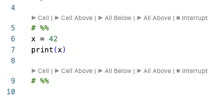

# Jupyter Console for VS Code

A VS Code extension that integrates Jupyter kernels with console interface for interactive Python development. Execute Python code directly from your editor and see results in dedicated output terminals.

## Installation

### Prerequisites

1. **Python 3.x** installed on your system
2. **VS Code Python Extension** (`ms-python.python`)
3. **jupyter-console** installed in your Python environment:
   ```bash
   pip install jupyter jupyter-console
   ```
   Note: The extension detects when `jupyter-console` is missing and allows to isntall it on the fly.

### Install the Extension

#### From VSIX File

1. Download the `.vsix` file from the github "Release" section for your operating system.
2. In VS Code, open the Command Palette (`Cmd+Shift+P` / `Ctrl+Shift+P`)
3. Run `Extensions: Install from VSIX...`
4. Select the downloaded `.vsix` file

#### From VS Code Marketplace

_(Coming soon)_

### Initial Setup

1. Open a Python file in VS Code
2. Select a Python interpreter: `Python: Select Interpreter` from Command Palette
3. The extension will automatically detect your Python environment

## User Guide

### Status Bar

The extension adds a status bar item on the right side showing the kernel state

**Status Bar States:**

| State        | Icon         | Status Bar                                                          | Meaning            | Click Action     |
| ------------ | ------------ | ------------------------------------------------------------------- | ------------------ | ---------------- |
| **Stopped**  | ⊘            |  | No kernel running  | Start kernel     |
| **Starting** | ⟳ (animated) |        | Kernel starting up | n/a              |
| **Running**  | ✓            |  | Kernel ready       | n/a              |
| **Busy**     | ⟳ (animated) |        | Executing code     | Interrupt kernel |

**Environment Display:**
The status bar shows your Python environment name (e.g., `venv`, `conda_env`, or `Python`) in brackets, automatically extracted from your selected Python interpreter. In the above table the python environment is `work`.

### Editor Actions Menu

When editing Python files, a _Jupyter Kernel_ and a _Run in Console_ menu appears in the editor toolbar:

- _Jupyter Kernel_ menu

  

  The _Jupyter Kernel_ menu provides quick access to: `Start Kernel`, `Stop Kernel`, `Restart Kernel`. It uses the Python environment selected in the Microsoft Python extension.

- "_Run in Console_ menu

  

  The _Run in Console_ menu provides quick access to:

  - `Start Console Terminal` Start the Jupyter Console for the existing kernel (automatically started when kernel gets started)
  - `Run Cell and Advance` Run the code between two `# %%` markers that surround the cursor position and move cursor to beginning of next cell
  - `Run Cell` Run the code between two `# %%` markers that surround the cursor position and keep cursor where it was
  - `Run Selection/Line and Advance` Run the selected code or the line of the cursor when no code is selected and move cursor to beginning of next cell
  - `Run Selection/Line` Run the selected code or the line of the cursor when no code is selected
  - `Run All` Run complete code
  - `Interrupt Kernel` Interrupt code execution in kernel

### Jupyter Console

The extension creates one decated VS Code Terminal for the _Jupyter Console_. It is a traditional `jupyter-console` interface for interactive debugging and exploration. This console is connected to the Jupyter kernel and can see and change all variables.


The **Jupyter Console** terminal provides:

- Interactive Python REPL connected to the same kernel
- Full IPython features (magic commands, shell access, tab completion)
- Useful for debugging and interactive exploration

To start: Click the status bar or use the editor menu and select "Start Console Terminals"

Output from code executed from the editor (cells or selections) are separated by `Out[<filename>]` markers.

**Note:** This setup uses the least screen footage. In case the _Jupyter Console_ shoould be larger, you can increase the panel height (which will decrease the editor height), or use the VS Code features _Move Terminal into Editor Area_ or _Move Terminal into New Window_.


### Python Interpreter Integration

The extension automatically tracks your selected Python interpreter:


On the left you see the status bar item of the Python extension and on the right the status bar item of the Jupyter Console extension. When you change the Python interpreter, the extension automatically stops the kernel and updates itself to use the new environment.

**Automatic Behavior:**

- Extension detects the active Python interpreter on startup
- Displays environment name in status bar
- When you change interpreters, the extension:
  1. Stops the running kernel
  2. Closes all terminals
  3. Updates to the new Python environment

### Available Commands

All commands are accessible via:

- **Command Palette** (`Cmd+Shift+P` / `Ctrl+Shift+P`)
- **Status Bar** (click for quick actions)
- **Editor Menu** (Jupyter Kernel button)
- **Keyboard Shortcuts**

#### Kernel Management Commands

| Command                                    | Description                                                  |
| ------------------------------------------ | ------------------------------------------------------------ |
| `Jupyter Console: Start Kernel`            | Start a new Jupyter kernel using selected Python interpreter |
| `Jupyter Console: Stop Kernel`             | Stop the running kernel and close terminals                  |
| `Jupyter Console: Restart Kernel`          | Restart kernel (clears all variables)                        |
| `Jupyter Console: Interrupt Kernel`        | Send interrupt signal (Ctrl+C) to kernel                     |
| `Jupyter Console: Start Console Terminals` | Start the output viewer and console terminals                |

#### Code Execution Commands

These are the same as in the _Run in Console_ action menu, with their default keyboard shortcuts.

| Command                                           | Keyboard Shortcut      | Description                                             |
| ------------------------------------------------- | ---------------------- | ------------------------------------------------------- |
| `Jupyter Console: Run Cell and Advance`           | `Ctrl + Enter`         | Execute cell, move to next cell                         |
| `Jupyter Console: Run Cell`                       | `Ctrl + Shift + Enter` | Execute current cell (between `# %%` markers)           |
| `Jupyter Console: Run Selection/Line and Advance` | `Alt  + Enter`         | Execute selection/line, move cursor after               |
| `Jupyter Console: Run Selection/Line`             | `Alt  + Shift + Enter` | Execute selected code (or current line if no selection) |
| `Jupyter Console: Run All`                        |                        | Execute complete code                                   |
| `Jupyter Console: Interrupt Kernel`               | `Ctrl+Alt+I`           | Interrupt Kernel                                        |

**Additional Shortcut:**

#### CodeLens action buttons



For Python files with `# %%` cell markers the following cell activities are available:

- `▶ Cell` Run the cell below the cell marker and move cursor th next cell
- `▶ Cell Above` Run the cell above the cell marker and keep cursor
- `▶ All Below` Run all cells below the cell marker and keep cursor
- `▶ All Above` Run all cells above the cell marker and keep cursor
- `⏹ Interrupt` Interrupt any code execution

### Configuration

The extension provides configurable timeouts for different operations. Access via VS Code Settings (`Cmd+,` / `Ctrl+,`) and search for "Jupyter Console":

**User Settings:**

- `jupyterConsole.enableOutputViewer` (default: true)
  - Enable/disable the Jupyter Output viewer terminal
  - When disabled, only the Jupyter Console terminal is used
- `jupyterConsole.truncateInputLinesMax` (default: 10)
  - Maximum input code lines shown in Jupyter Output before truncating
  - Set to 0 to show all lines

**Advanced Settings:**

- `jupyterConsole.advanced.viewerTerminalStartDelay` (default: 1000ms)
  - Delay before starting output viewer terminal
- `jupyterConsole.advanced.consoleTerminalStartDelay` (default: 1000ms)
  - Delay before starting console terminal (allows conda/virtualenv activation to complete)
- `jupyterConsole.advanced.kernelOperationWait` (default: 1000ms)
  - Wait time for kernel operations (restart, initial connection)
- `jupyterConsole.advanced.kernelConnectionTimeout` (default: 10000ms)
  - Timeout for kernel connection file to appear
- `jupyterConsole.advanced.codeExecutionTimeout` (default: 30000ms)
  - Timeout for code execution to complete

_Increase these values on slower machines if you experience timeout errors._

## Other topics:

- [Supported workflows](docs/workflows.md)
- [The two-terminal option](docs/two-terminal-option.md)
- [Trouble-shooting](docs/trouble-shooting.md)
- [Extension Architecture](docs/architecture.md)
- [Contributing](docs/contributing.md)

## License

MIT License - see [LICENSE](LICENSE) file for details.

Copyright (c) 2025 Bernhard Walter

Developed with assistance from Claude Code by Anthropic.

## Credits

- Built using the [Jupyter Messaging Protocol](https://jupyter-client.readthedocs.io/en/stable/messaging.html)
- Uses [ZeroMQ](https://zeromq.org/) for kernel communication
- Integrates with [VS Code Python Extension](https://marketplace.visualstudio.com/items?itemName=ms-python.python)
